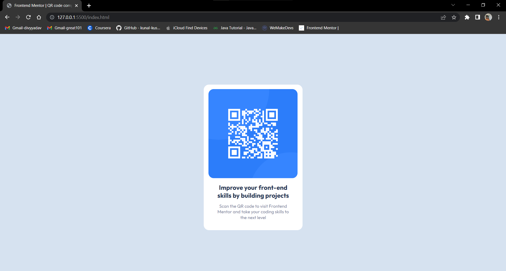

# Frontend Mentor - QR code component solution

This is my solution to the [QR code component challenge on Frontend Mentor](https://www.frontendmentor.io/challenges/qr-code-component-iux_sIO_H). Frontend Mentor challenges help you improve your coding skills by building realistic projects. 

## Table of contents

- [Overview](#overview)
  - [Screenshot](#screenshot)
  - [Links](#links)
  - [Built with](#built-with)
  - [What I learned](#what-i-learned)
  - [Continued development](#continued-development)
- [Author](#author)

## Overview
Creating a qr code page for website.

### Screenshot

### Links

- Solution URL: [Solution URL](https://github.com/divyanshu0469/qr-code-component-main)
- Live Site URL: [Live Site URL](https://your-live-site-url.com)

### Built with

- Semantic HTML5 markup
- CSS custom properties
- Flexbox
- Mobile-first workflow

### What I learned

I learned how to use various css styling tools and properties to manipulate a web page and get a desired result as a well polished final end product.

### Continued development

I will continue practising more css web pages and doing more complex tasks in future to get furthermore improve my skill level.  

## Author

- Frontend Mentor - [@divyanshu0469](https://www.frontendmentor.io/profile/divyanshu0469)
- LinkedIn - [@divyyanshu31](www.linkedin.com/in/divyyanshu31)